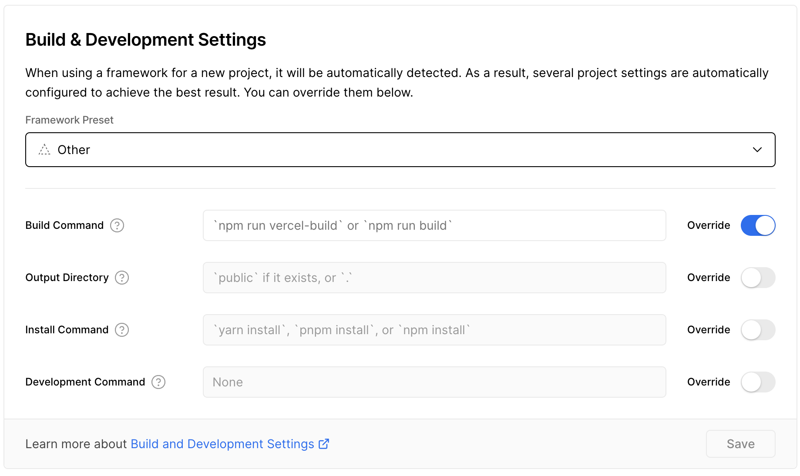

# Deploy your doc site to production

Most ConsenSys documentation sites use [Vercel](https://vercel.com/) as a hosting platform.

The main benefits of using Vercel instead GitHub Pages for hosting include:

- The ease of integration with GitHub repositories.
- The ability to deploy automatic previews on pull requests.

You can deploy your documentation site in a [public GitHub repository](#public-repository) or
[private GitHub repository](#private-repository) to production using Vercel.
Private repositories require a little more setup.

## Public repository

Follow these steps to deploy your public GitHub repository to Vercel:

1. Copy the `vercel.json` file in the root of this template repository to the root of your
   documentation repository.

   :::note
   This file contains some URL redirects from older MkDocs docs before we migrated most ConsenSys
   docs to Docusaurus.
   If your docs did not pre-exist in MkDocs, then you can remove these fields.
   :::

   :::caution important
   Make sure `cleanUrls` is set to `true` in `vercel.json`.
   This ensures that Vercel deploys the app properly without expecting trailing slashes.
   :::

2. Determine the public URL that you want to use to expose the doc site.
   Typically, the URL follows the format of `https://docs.<YOUR_PRODUCT>.consensys.net`.
   You can customize this to your needs.

3. Join the [**#documentation**](https://consensys.slack.com/archives/C0272B5P1CY) channel on
   ConsenSys Slack and ask for Vercel integration for your repository.
   Provide a link to your repository in your message.

Once your repository is integrated with Vercel, any new PRs should have a Vercel bot update with a
preview link on all new commits to that PR.


## Private repository

Follow these steps to deploy your private GitHub repository to Vercel:

1. Join the [**#documentation**](https://consensys.slack.com/archives/C0272B5P1CY) channel on
   ConsenSys Slack and ask for Vercel integration for your private repository.
   Provide a link to your repository in your message.

2. Your `build.yml` file in the `.github/workflows` directory will be modified to look like the
   following (you **do not** need to take this action yourself).
   Essentially, this modification bypasses Vercel limitations on private repositories by having
   GitHub actions build and push the static build directly to Vercel.

    ```yaml title=".github/workflows/build.yml"
    ---
    name: Build and Preview
    
    on:
      pull_request:
        branches:
          - main
      push:
        branches:
          - main
    
    jobs:
      build:
        name: Build
        runs-on: ubuntu-latest
        # the environment to deploy to / use secrets from
        environment: vercel
        # modify the default permissions of the GITHUB_TOKEN, to only allow least privileges
        permissions:
          contents: read
          pull-requests: write
        steps:
          - uses: actions/checkout@v3
          - name: Build
            uses: ConsenSys/docs-gha/build@main
            with:
              GITHUB_TOKEN: ${{ secrets.GITHUB_TOKEN }}
          - run: cp vercel.json ./build
          - uses: amondnet/vercel-action@v25.1.1
            id: vercel-action-staging
            if: github.event_name == 'pull_request'
            with:
              github-token: ${{ secrets.GITHUB_TOKEN }}
              vercel-token: ${{ secrets.VERCEL_TOKEN }}
              vercel-org-id: ${{ secrets.ORG_ID }}
              vercel-project-id: ${{ secrets.PROJECT_ID }}
              working-directory: ./build
              scope: infura-web
          - uses: amondnet/vercel-action@v25.1.1
            id: vercel-action-production
            if: github.event_name == 'push'
            with:
              github-token: ${{ secrets.GITHUB_TOKEN }}
              vercel-token: ${{ secrets.VERCEL_TOKEN }}
              vercel-org-id: ${{ secrets.ORG_ID }}
              vercel-project-id: ${{ secrets.PROJECT_ID }}
              working-directory: ./build
              vercel-args: "--prod "
              scope: infura-web
              github-comment: false
    ```

   The action also provides preview URLs on
   new commits to a PR.

   

### Set up a private repository with Vercel (for doc team only)

1. Install the [Vercel CLI](https://vercel.com/docs/cli#installing-vercel-cli).
2. Run `vercel login`.
   Make sure you log in with an account that's part of the **Infura Web** team account.
3. Run `vercel link` in the root directory of your Docusaurus project.
   1. Make sure to link to the **Infura Web** account and not your personal one.
   2. If you previously created the project in the account, you can link to the existing one.
      Otherwise, create a new one.
4. After completing the prompts, you should see a `.vercel` directory that includes a JSON file with
   `Project ID` and `Org ID`.
5. Log in to the [Vercel dashboard](https://vercel.com/account/tokens) and navigate to the
   **Tokens** setting.
6. Create a new token with the scope selected to **Infura Web** and expiration set to **never**.
   Make sure to copy this somewhere securely (preferably 1Password), since this token will never be
   shown again.
   If you lose it, it must be deleted and regenerated.
   There's also a security concern, since these tokens have access to the entire **Infura Web** account.
7. Navigate to your environments setting in GitHub:
   `https://github.com/ConsenSys/<DOC_REPO>/settings/environments`.
8. Create a new environment titled `vercel`.
9. Add three new environment secrets to the `vercel` environment:
   1. `ORG_ID` - `orgId` in `project.json` in the `.vercel` directory.
   2. `PROJECT_ID` - `projectId` in `project.json` in the `.vercel` directory.
   3. `VERCEL_TOKEN` - Token generated from steps 5-6.
10. Copy the modified `build.yml` file and put it into the `.github/workflows` directory.
11. Navigate to your project settings on the Vercel dashboard and change the **Build & Development
    Settings** under **General** for **Framework Preset** to **Other** and toggle the **Override**
    for **Build Command** and leave it empty.
    Save these settings.

    

    Any new PR or push to `main` automatically triggers the action to build within GitHub and push
    the artifacts to Vercel directly.
12. Edit the actions if there's something different about your doc repository (for example, the main
    branch is called `master` instead of `main`).
